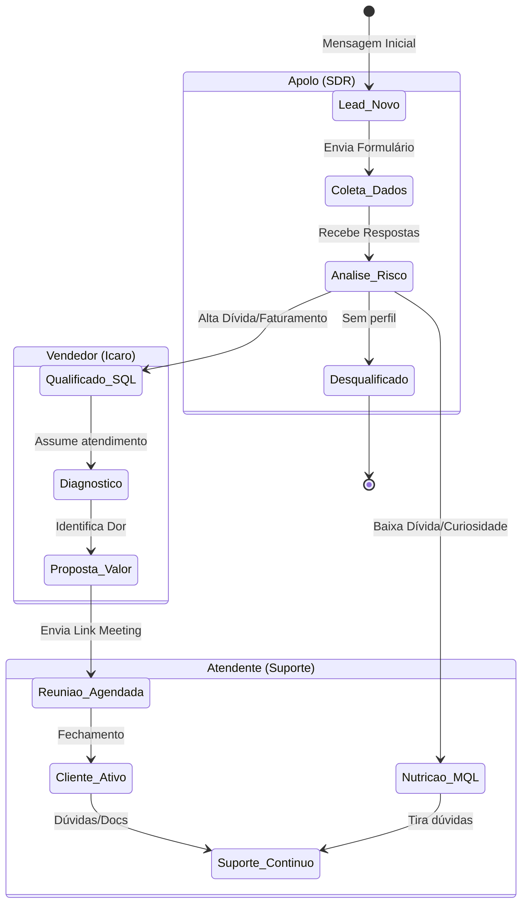
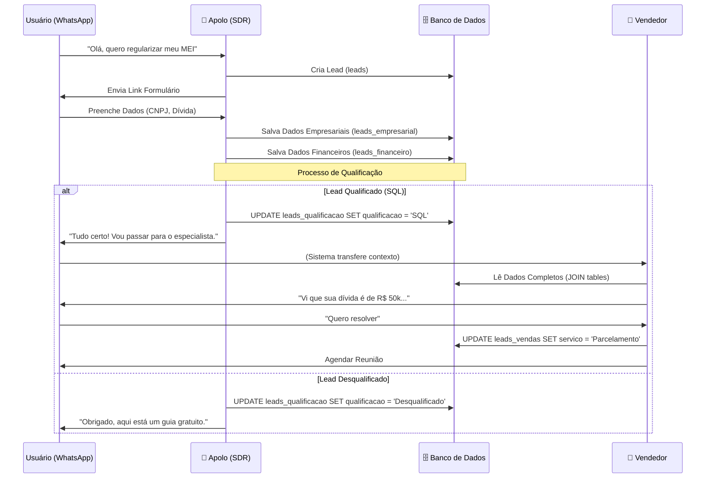

# Ciclo de Vida do Lead e Fluxo de Dados

Este documento ilustra como os dados são transformados e enriquecidos conforme o lead interage com os diferentes agentes (Apolo, Vendedor, Atendente).

## Fluxo de Agentes (State Diagram)

## Fluxo de Enriquecimento de Dados (Sequence Diagram)

## Gatilhos de Mudança de Fase

1.  **De `Lead` para `SQL` (Sales Qualified Lead):**
    *   **Quem decide:** Apolo.
    *   **Critério:** Faturamento > X OU Dívida > Y.
    *   **Ação no Banco:** Tabela `leads_qualificacao`, coluna `qualificacao` = 'SQL'.

2.  **De `SQL` para `Reunião`:**
    *   **Quem decide:** Vendedor (Icaro).
    *   **Critério:** Cliente aceitou link da reunião.
    *   **Ação no Banco:** Tabela `leads_vendas`, coluna `data_reuniao` preenchida.

3.  **De `Reunião` para `Cliente`:**
    *   **Quem decide:** Humano (Haylander) ou Integração Pós-Venda.
    *   **Critério:** Contrato assinado.
    *   **Ação no Banco:** Tabela `leads_qualificacao`, coluna `situacao` = 'cliente'.
