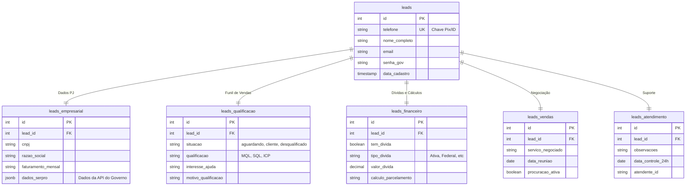

# Estrutura de Dados Modular (Arquitetura Satélite)

O sistema utiliza uma arquitetura de dados "Estrela" (ou Satélite), onde uma tabela central (`leads`) armazena a identidade única do usuário, e tabelas especializadas armazenam dados contextuais de cada fase da jornada.

## Diagrama de Entidade-Relacionamento (ERD)

## Detalhamento dos Módulos

### 1. Core (`leads`)
É a identidade do cliente. O número de telefone é a chave principal de busca (E.164).
*   **Quem usa:** Todos os agentes.
*   **Objetivo:** Unicidade e contato.

### 2. Qualificação (`leads_qualificacao`)
Armazena o "termômetro" do lead.
*   **Quem usa:** Apolo (SDR).
*   **Campos Chave:**
    *   `qualificacao`: Define se o lead vale o tempo do vendedor (ICP/SQL) ou se deve ser nutrido (MQL).
    *   `situacao`: Estado atual no fluxo.

### 3. Empresarial (`leads_empresarial`)
Dados duros e técnicos, muitas vezes enriquecidos via API (Serpro).
*   **Quem usa:** Apolo (coleta inicial) e Vendedor (análise técnica).
*   **Destaque:** Armazena o JSON bruto da API do Serpro para consultas futuras.

### 4. Vendas (`leads_vendas`)
O "balcão" de negociação.
*   **Quem usa:** Vendedor (Icaro).
*   **Foco:** Agendamento de reunião e definição de escopo (serviço).

### 5. Financeiro (`leads_financeiro`)
Inteligência de dívidas.
*   **Quem usa:** Sistema de Cálculo Automático e Vendedor.
*   **Foco:** Valores exatos para gerar propostas de parcelamento.
